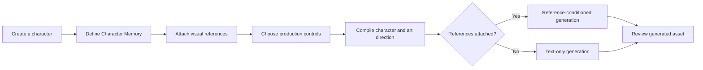

# Atlas

### AI-powered game asset creation with consistent art direction.

Atlas is a creative workspace for generating game assets from reusable character profiles, visual references, and production rules.

Instead of rebuilding prompts for every image, creators define the character and art direction once, then use AI to generate assets that stay visually consistent.

> **Private beta** — Atlas is under active development. Generated assets should be reviewed before production use.

## Screenshots

### Character workspace


### Asset generation


### Generated result


## Core features

### AI reference-conditioned generation

Attach visual references to a character and use them immediately during generation.

Atlas sends the original reference image files into the image-generation workflow instead of reducing them to titles or text metadata alone.

### Persistent character and art direction

Store reusable character identity, lore, visual direction, preferred prompting, and design rules in Character Memory.

That context remains available across multiple production requests instead of living in a disposable chat session.

### Structured creative controls

Choose the asset type, visual style, camera or view, background, ground-shadow treatment, and optional art direction without manually rebuilding a long prompt.

Atlas combines those controls with the selected character and visual references into one structured generation request.

### Consistent game-asset workflow

Atlas is designed for continuity rather than isolated outputs.

Character profiles, persistent memory, visual references, production settings, and user intent are compiled into a reusable AI-assisted workflow for generating static, vector-style, and pixel-art assets.

### Character and reference management

Create and edit characters, attach visual references, update persistent memory, and keep each character’s production context together in one workspace.

New visual references become active immediately and can be edited or deleted at any time.

### English and Simplified Chinese interface

Switch the product interface between English and Simplified Chinese without reloading the page.

Character names, user prompts, uploaded asset names, and generated content remain unchanged.

## Workflow



Visual references are optional, but every attached, non-deleted reference is treated as active. Removing a reference excludes it from subsequent generations.

## Tech stack

- [Next.js](https://nextjs.org/) and React
- TypeScript
- Tailwind CSS
- Prisma ORM with Neon PostgreSQL
- OpenAI API for task parsing and image generation
- Node.js test runner via `tsx`

The product uses server-side routes for persistence, prompt compilation, short-lived generation authorization, and image requests. Provider credentials remain on the server.

## Local development

### Prerequisites

- A current Node.js LTS release
- npm
- A Neon PostgreSQL database
- An OpenAI API key

### Setup

1. Install dependencies:

   ```bash
   npm install
   ```

2. Create a local environment file from the safe template:

   ```bash
   cp .env.example .env.local
   ```

3. Set the required values in `.env.local`:

   ```dotenv
   DATABASE_URL="your-pooled-neon-postgresql-connection-string"
   OPENAI_API_KEY="your-api-key"
   ```

   The template also exposes optional model overrides. Keep the defaults unless you are intentionally testing a different supported model.

4. Create the local database schema:

   ```bash
   npx prisma migrate dev
   ```

5. Start Atlas:

   ```bash
   npm run dev
   ```

   Open [http://localhost:3000](http://localhost:3000).

### Quality checks

```bash
npm test
npx tsc --noEmit
npm run lint
npm run build
```

### Security and operational safeguards

- Secrets and provider credentials are kept server-side and excluded from version control.
- Generation requests use short-lived authorization and server-side validation.
- Uploaded references and generated assets are treated as private project data.
- Database schema and migrations are versioned without committing connection strings.

## Roadmap

Atlas is evolving toward a broader character-production workspace. Current areas of exploration include:

- Additional production-ready asset modes
- More review and iteration tools for generated assets
- Stronger visual consistency evaluation
- Expanded export and handoff workflows
- Collaboration features for creative teams

Roadmap items are directional and are not commitments to specific release dates.

## License

Atlas is available under the [MIT License](LICENSE).
