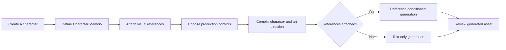

# Atlas

### Build a character once. Create a consistent world around it.

Atlas is a reference-driven creative production platform for making game assets that stay aligned with a character’s identity and visual language.

Instead of rebuilding art direction for every prompt, creators establish a reusable character source, attach visual references, and carry that context into each generation.

> **Private beta** — Atlas is under active development. Generated assets should be reviewed before production use.

## Product introduction

Game asset generation is rarely a one-prompt problem. A character needs to remain recognizable across new objects, poses, views, and production requests—even as the brief evolves.

Atlas turns that work into a repeatable creative workflow:

- Character profiles hold the core identity and description.
- Character Memory preserves durable art direction and design rules.
- Visual references provide direct style and rendering context.
- Production controls shape the asset type, visual style, camera, background, and shadow treatment.
- A structured compiler combines those inputs into one generation request.

When visual references are attached, Atlas sends the actual reference images through a reference-conditioned image-edit path. Without references, it uses text-only image generation. The result is a workflow designed for continuity, not isolated outputs.

## Screenshots

### Character workspace

> Screenshot placeholder — character profile, memory, and visual reference library.

### Asset production

> Screenshot placeholder — generation controls and creative direction.

### Generated result

> Screenshot placeholder — a completed asset generated from character context.

## Core features

### Reference-driven generation

Attach visual references to a character and use them immediately. Atlas passes the source image files into reference-conditioned generation so style guidance is not reduced to titles or metadata alone.

### Persistent art direction

Store visual style, lore, preferred prompting, and design rules in Character Memory. That context remains available across production requests instead of living in a disposable chat.

### Consistent game assets

Combine character identity, visual references, and explicit production controls to create static game assets with a repeatable visual brief. Pixel-art mode adds constraints for crisp pixels, limited palettes, simple shading, and sprite-scale readability.

### Creative control without prompt reconstruction

Choose the asset type, visual style, camera or view, background, and ground-shadow treatment directly. Optional art direction remains available for briefs that need additional specificity.

### Character and reference management

Create and edit characters, add or remove their visual references, and keep each character’s production context together in one workspace.

### English and Simplified Chinese interface

Switch the product interface between English and Simplified Chinese without reloading the page. User-authored content, character names, prompts, and generated output remain unchanged.

## Workflow



Visual references are optional, but every attached, non-deleted reference is treated as active. Removing a reference excludes it from subsequent generations.

## Tech stack

- [Next.js](https://nextjs.org/) and React
- TypeScript
- Tailwind CSS
- Prisma ORM with SQLite
- OpenAI API for task parsing and image generation
- Node.js test runner via `tsx`

The product uses server-side routes for persistence, prompt compilation, short-lived generation authorization, and image requests. Provider credentials remain on the server.

## Local development

### Prerequisites

- A current Node.js LTS release
- npm
- An OpenAI API key

### Setup

1. Install dependencies:

   ```bash
   npm install
   ```

2. Create a local environment file from the safe template:

   ```bash
   cp .env.example .env.local
   ```

3. Set the required values in `.env.local`:

   ```dotenv
   DATABASE_URL="file:./prisma/dev.db"
   OPENAI_API_KEY="your-api-key"
   ```

   The template also exposes optional model overrides. Keep the defaults unless you are intentionally testing a different supported model.

4. Create the local database schema:

   ```bash
   npx prisma migrate dev
   ```

5. Start Atlas:

   ```bash
   npm run dev
   ```

   Open [http://localhost:3000](http://localhost:3000).

### Quality checks

```bash
npm test
npx tsc --noEmit
npm run lint
npm run build
```

### Repository safety

- Never commit `.env.local`, API keys, tokens, or other credentials.
- Local SQLite databases are intentionally excluded from version control.
- Commit `prisma/schema.prisma` and migration files, not a local database file.
- Uploaded references and generated assets may contain private creative material; use appropriate data and access practices for your environment.
- Generation calls can incur API usage costs. Avoid retrying requests blindly after network or provider errors.

## Roadmap

Atlas is evolving toward a broader character-production workspace. Current areas of exploration include:

- Additional production-ready asset modes
- More review and iteration tools for generated assets
- Stronger visual consistency evaluation
- Expanded export and handoff workflows
- Collaboration features for creative teams

Roadmap items are directional and are not commitments to specific release dates.

## License

Atlas is available under the [MIT License](LICENSE).
